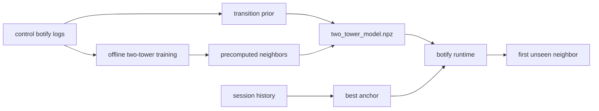

# Homework 2: Two-Tower Recommender

## Abstract

В treatment используется standalone two-tower модель для next-track recommendation. Модель обучается offline на botify-логах и материализует для каждого anchor-трека список ближайших следующих треков; online-сервис только выбирает первый unseen кандидат из этого ML-артефакта. Контроль в A/B эксперименте остается исходным SasRec-I2I.

## Details

Обучение находится в `botify/training/train_two_tower_recommender.py`. Скрипт читает botify-логи `data.json` и собирает завершенные сессии отдельно по каждому прогону симулятора. Two-tower обучается pairwise next-item objective: context tower кодирует последние `max_len` треков, positive item - следующий реально прослушанный трек, negatives семплируются из популярной части каталога и случайных треков. Loss взвешивается временем прослушивания positive-трека, чтобы сильнее оптимизироваться под session-time метрику. После обучения для каждого трека заранее сохраняется `neighbors[track]`: сначала идут сильные transition-кандидаты из control-сессий, затем добор ближайшими item tower соседями, затем popular fallback.

## A/B Results

Оффлайн A/B был запущен на 5000 эпизодах. Целевая метрика `mean_time_per_session` выросла на `12.46%`, доверительный интервал полностью выше нуля.

| treatment | metric | control_mean | treatment_mean | effect_pct | lower_pct | upper_pct | significant |
|---|---:|---:|---:|---:|---:|---:|---|
| T1 | time | 10.1520 | 11.4801 | 13.08 | 8.30 | 17.86 | True |
| T1 | sessions | 1.3641 | 1.3422 | -1.60 | -4.38 | 1.18 | False |
| T1 | mean_tracks_per_session | 12.5825 | 13.4611 | 6.98 | 4.55 | 9.41 | True |
| T1 | mean_time_per_session | 7.5535 | 8.4949 | 12.46 | 8.72 | 16.20 | True |
| T1 | mean_request_latency | 0.8947 | 0.6632 | -25.87 | -50.77 | -0.98 | True |
